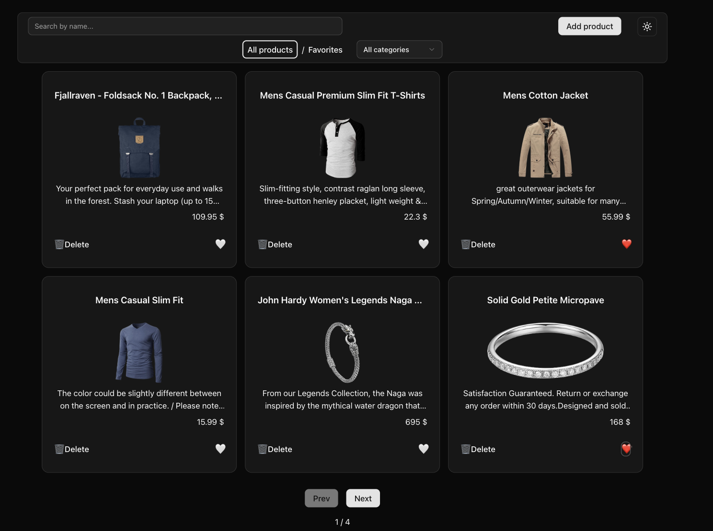

# 🛍️ Products App

Небольшое React-приложение для управления товарами: просмотр, фильтрация, поиск, добавление и редактирование.

## ✨ Возможности

- 📦 Просмотр списка продуктов
- ❤️ Фильтрация по всем товарам / избранным
- 🔍 Поиск по названию товара
- 🏷️ Фильтрация по категориям
- ☀️ Переключение темы темная / светлая
- 📑 Пагинация (переключение страниц)
- ➕ Создание новых товаров
- ✏️ Редактирование и удаление товаров
- ⭐ Добавление/удаление товара из избранного
- ✅ Валидация форм при создании продукта

## 🛠️ Стек технологий

- **React + TypeScript**
- **Redux Toolkit** — управление состоянием
- **React Router** — маршрутизация
- **Tailwind CSS + shadcn/ui** — UI и стили
- **Vite** — сборка проекта

## 🚀 Запуск проекта

```bash
# Установить зависимости
npm install

# Запустить проект в dev-режиме
npm run dev

# Собрать production-билд
npm run build
```

## 📸 Скриншоты


